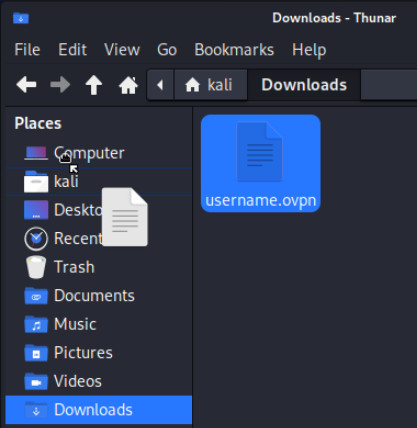
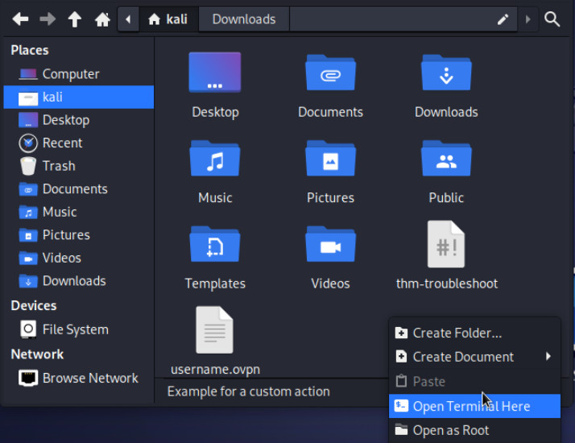
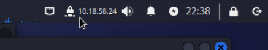

# AttackBox with Kali Linux

## Step 1 - Install virtualization software

NOTE OneDrive password can be found on moodle.

See [Troubleshooting](#troubleshooting) section if you have any problems.

### Windows

1. Go to [VirtualBox website](https://www.virtualbox.org/wiki/Downloads) and
download "Windows host" file and install.
2. Download [Kali VirtualBox image](https://erhvervsakademisydvest-my.sharepoint.com/:u:/g/personal/rpe_easv_dk/ETM5F5SmniZBnUdCBD2vSfMBjyuNRx5gd1EzBC-GwMbb7A?e=kNSMzu)
3. Extract and open the file (with red icon) which will start Kali virtual machine in VirtualBox

### macOS

It depends on your processor.

If you have an **Intel** CPU (prior to 2020):

1.  Download and install "​macOS / Intel hosts" of [VirtualBox](https://www.virtualbox.org/wiki/Downloads).
2. Download [Kali VirtualBox image](https://erhvervsakademisydvest-my.sharepoint.com/:u:/g/personal/rpe_easv_dk/ETM5F5SmniZBnUdCBD2vSfMBjyuNRx5gd1EzBC-GwMbb7A?e=kNSMzu)
3. Extract and open the file (with red icon) which will start Kali virtual machine in VirtualBox


If you have a new Mac (after 2020) it likely has an **Apple Silicon** chip. You
therefore need a different program to run a x86 OS in a VM:

1. Download and install [UTM](https://mac.getutm.app/).
2. Download [Kali UTM image](https://erhvervsakademisydvest-my.sharepoint.com/:u:/g/personal/rpe_easv_dk/EW3U8G7JHjNLrindNJR2Cc8Bb7iNPY_QS5FSznftxTZSOw)
3. Extract and open the file which will start Kali virtual machine in UTM

## Step 2 - Login

- Username: kali
- Password: kali

Use that password every time Kali Linux asks for one.

## Step 3 - Configure VPN

You will need to setup a VPN connection to TryHackMe so you can access machines
in the exercises.

- Open Firefox within Kali.
- Go to [https://tryhVackme.com/access](https://tryhackme.com/access)
    - Login or Join if you haven't already
- Click "Download My Configuration File"

Move the ovpn file to the "kali" folder as seen:



Navigate to "kali" folder and open a terminal.



- Type `./thm-troubleshoot`
- Accept all the defaults
- Enter "kali" when asked for a password.

You should see an IP in the top bar meaning that the VPN connection have been
established.



Verify that there is a checkmark in the "Connected" field at
[https://tryhVackme.com/access](https://tryhackme.com/access).

## Troubleshooting

### Image is too big

If your computer doesn't have enough disk space for the image then you can put
it in on USB-stick. 
Just make sure it is formatted with something other than FAT32.
Because FAT32 have a max file size of 4.3GiB.

### No internet

Make sure you host OS is online.

Your VM might be using the same MAC address as somebody else because the image
is an exact clone.

To fix this try to run:

```sh
sudo macchanger -r eth0
```
