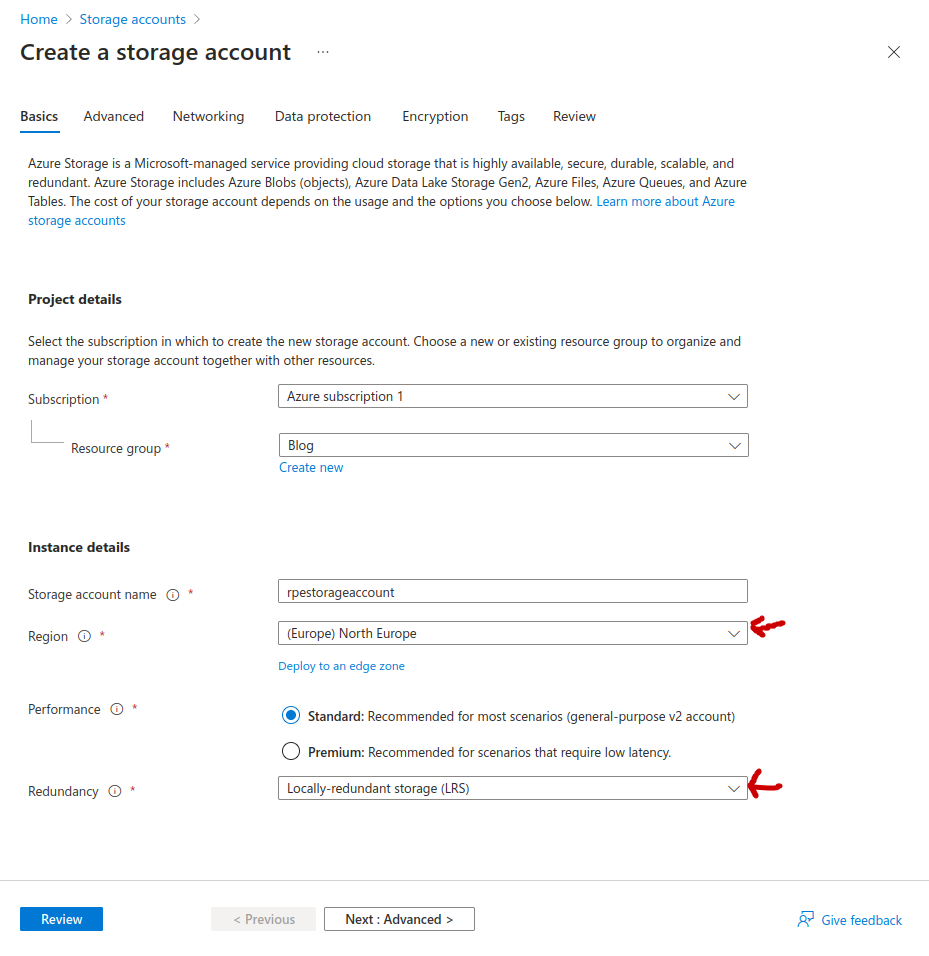
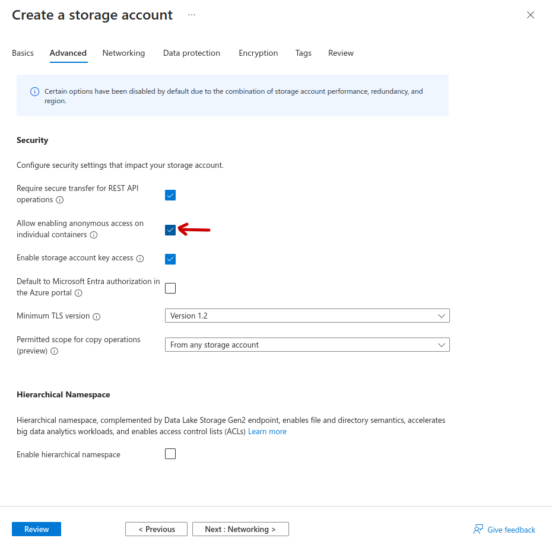
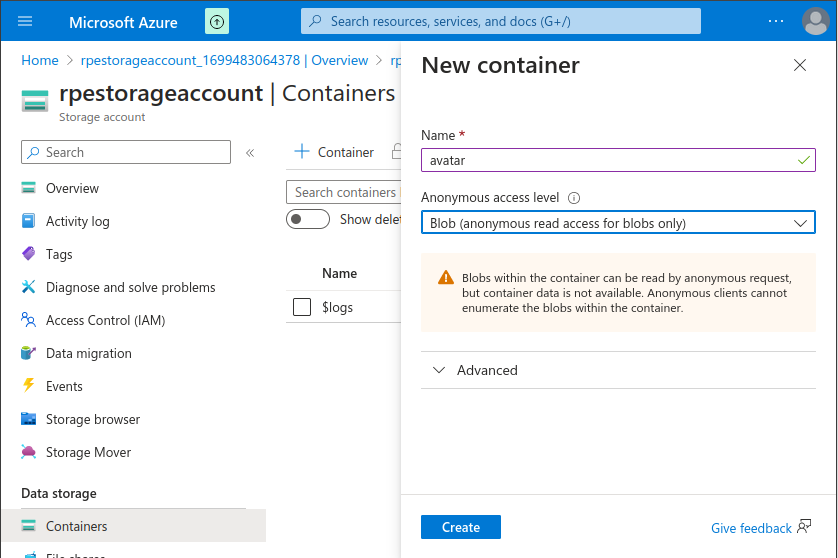
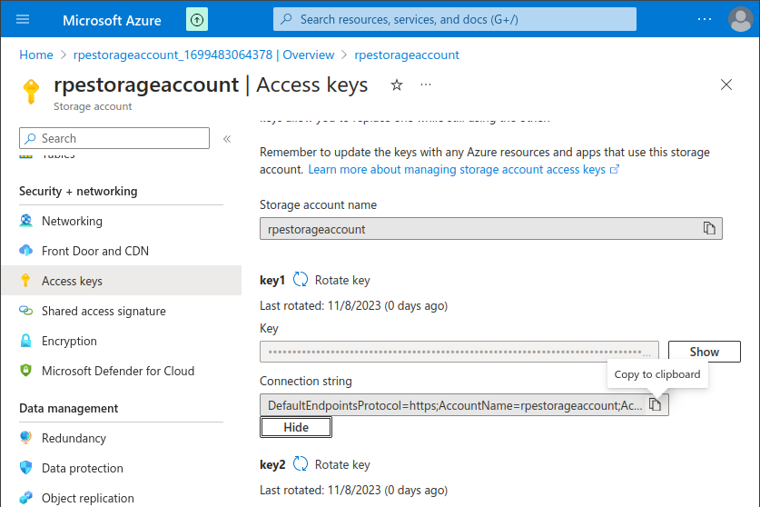

# Avatar upload

The goal is to add functionality to upload/change avatar on the blog
application.

To store the files we will be using blob storage on Azure.

You can find the starter project here [https://github.com/rpede/aspnet_security/tree/cloud](https://github.com/rpede/aspnet_security/tree/cloud).

Notice the branch is **Cloud**.
It is almost identical to that from last week though.

## Frontend

First thing we need to do is to add an update method to account service on the
client.

**frontend/src/app/account/account.service.ts**

Add:

```typescript
// Under the other interfaces
export interface AccountUpdate {
  fullName: string;
  email: string;
  avatar: File | null;
}

// Inside AccountService class

  update(value: AccountUpdate) {
    const formData = new FormData();
    Object.entries(value).forEach(([key, value]) =>
      formData.append(key, value)
    );
    return this.http.put<User>('/api/account/update', formData, {
      reportProgress: true,
      observe: 'events'
    });
  }
```

JSON is not very efficient for uploading files.
We therefore use multi-part form as described [here](https://developer.mozilla.org/en-US/docs/Web/HTTP/Methods/POST) for the request.
To do that in JavaScript/TypeScript we would use the [FormData](https://developer.mozilla.org/en-US/docs/Web/API/XMLHttpRequest_API/Using_FormData_Objects) API.

`reportProgress: true` and `observe: 'events'` are so that we get progress
updates while uploading.

**frontend/src/app/account/account.component.ts**

For the component we need to do a couple different adjustments.
I will briefly go over them individually, then you will get the full code.

This is roughly the changes made to the template:

1. Add a form definition using `FormBuilder`
2. Add `formGroup` to form element in HTML
3. Replace `[value]` with `formControlName` for the fields (fullName, email, avatar)
4. Disable Admin toggle
5. Add progress bar to indicate upload progress
6. Add click event to submit button

We can use pathValue to apply values to a form definition from an object.
The fields `avatarUrl` and `isAdmin` are not found directly on the form, so they
are assigned to instance variables instead.

```typescript
async ngOnInit() {
  var account = await firstValueFrom(this.service.getCurrentUser());
  this.form.patchValue(account);
  this.avatarUrl = account.avatarUrl;
  this.isAdmin = account.isAdmin;
  this.loading = false;
} 
```

We need a file input and a ion-img element to show the avatar.
Notice `type="file"` and `accept="image/png, image/jpeg"`.
Read more [here](https://developer.mozilla.org/en-US/docs/Web/HTML/Element/input/file).

```html
<ion-img [src]="avatarUrl"></ion-img>
<ion-input
  label="Avatar"
  type="file"
  formControlName="avatar"
  accept="image/png, image/jpeg"
  (change)="onFileChanged($event)"
></ion-input>
```

This event handler gets called when an image is selected.

```typescript
onFileChanged($event: Event) {
  // The event contains all/any selected files
  const files = ($event.target as HTMLInputElement).files;
  if (!files) return;
  // Set the form field to first file
  this.form.patchValue({avatar: files[0]});
  // This would update the validation of the form field, if we had any validators
  this.form.controls.avatar.updateValueAndValidity();
  // In order to make a preview of the avatar in ion-img we need to convert it to a data URL
  const reader = new FileReader();
  reader.readAsDataURL(files[0]);
  reader.onload = () => {
    this.avatarUrl = reader.result;
  }
}
```

Here are the implementation of the submit method for the form.

```typescript
submit() {
  if (this.form.invalid) return;
  this.uploading = true;
  this.service.update(this.form.value as AccountUpdate)
    .pipe(finalize(() => {
      // When the observable closes
      this.uploading = false;
      this.uploadProgress = null;
    }))
    .subscribe(event => {
      if (event.type == HttpEventType.UploadProgress) {
        // If the event type is UploadProgress we calculate the progress in percentage
        this.uploadProgress = Math.round(100 * (event.loaded / (event.total ?? 1)))
      } else if (event.type == HttpEventType.Response && event.body) {
        // When upload is done the server will generate a response.
        // We patch the form to make sure it is in sync with server.
        this.form.patchValue(event.body);
      }
    });
}
```

**Full version**

```typescript
import {Component, OnInit} from "@angular/core";
import {delay, finalize, firstValueFrom} from "rxjs";
import {AccountService, AccountUpdate} from "./account.service";
import {FormBuilder, Validators} from "@angular/forms";
import {HttpEventType} from "@angular/common/http";

@Component({
  template: `
    <app-title title="Account"></app-title>
    <ion-content>
      <form [formGroup]="form" (ngSubmit)="submit()">
        <ion-list class="field-list" *ngIf="loading; else loading">
          <ion-item>
            <ion-input label="Name" formControlName="fullName"></ion-input>
          </ion-item>

          <ion-item>
            <ion-input label="Email" formControlName="email"></ion-input>
          </ion-item>

          <ion-item>
            <ion-img [src]="avatarUrl"></ion-img>
            <ion-input type="file" label="Avatar" formControlName="avatar" accept="image/png, image/jpeg"
                       (change)="onFileChanged($event)"></ion-input>
          </ion-item>

          <ion-item>
            <ion-toggle disabled [checked]="isAdmin">Administrator</ion-toggle>
          </ion-item>
        </ion-list>
        <ion-progress-bar *ngIf="uploading" [value]="uploadProgress"></ion-progress-bar>
        <ion-button *ngIf="form.valid && !uploading" (click)="submit()">Update</ion-button>
      </form>
      <ng-template #loading>
        <ion-spinner></ion-spinner>
      </ng-template>
    </ion-content>
  `,
  styleUrls: ['./form.css'],
})
export class AccountComponent implements OnInit {
  loading: boolean = true;
  uploading: boolean = false;
  uploadProgress: number | null = null;

  form = this.fb.group({
    fullName: ['', Validators.required],
    email: ['', Validators.required],
    avatar: [null as File | null],
  });
  avatarUrl: string | ArrayBuffer | null = null;
  isAdmin?: boolean;

  constructor(
    private readonly fb: FormBuilder,
    private readonly service: AccountService,
  ) {
  }

  async ngOnInit() {
    var account = await firstValueFrom(this.service.getCurrentUser());
    this.form.patchValue(account);
    this.avatarUrl = account.avatarUrl;
    this.isAdmin = account.isAdmin;
    this.loading = false;
  }

  onFileChanged($event: Event) {
    const files = ($event.target as HTMLInputElement).files;
    if (!files) return;
    this.form.patchValue({avatar: files[0]});
    this.form.controls.avatar.updateValueAndValidity();
    const reader = new FileReader();
    reader.readAsDataURL(files[0]);
    reader.onload = () => {
      this.avatarUrl = reader.result;
    }
  }

  submit() {
    if (this.form.invalid) return;
    this.uploading = true;
    this.service.update(this.form.value as AccountUpdate)
      .pipe(finalize(() => {
        this.uploading = false;
        this.uploadProgress = null;
      }))
      .subscribe(event => {
        if (event.type == HttpEventType.UploadProgress) {
          this.uploadProgress = Math.round(100 * (event.loaded / (event.total ?? 1)))
        } else if (event.type == HttpEventType.Response && event.body) {
          this.form.patchValue(event.body);
        }
      });
  }
}
```

## Backend

Now for the backend.
Lets first implement the update functionality without the avatar.
We will come back after and add it in. 

### Update account

We need a update method in the repository.

**infrastructure/Repositories/UserRepository.cs**

```csharp
    public User Update(int id, string fullName, string email, string? avatarUrl, bool admin = false)
    {
        const string sql = $@"
UPDATE users 
SET full_name = @fullName, email = @email, avatar_url = @avatarUrl, admin = @admin
WHERE id = @id
RETURNING
    id as {nameof(User.Id)},
    full_name as {nameof(User.FullName)},
    email as {nameof(User.Email)},
    avatar_url as {nameof(User.AvatarUrl)},
    admin as {nameof(User.IsAdmin)}
    ;
";
        using var connection = _dataSource.OpenConnection();
        return connection.QueryFirst<User>(sql, new { id, fullName, email, avatarUrl, admin });
    }
```

A model for the request parameters.
Notice that avatar file isn't part of the model.
That is because it won't be stored in the SQL database.

**service/Models/Command/UpdateAccountCommandModel.cs**

```csharp
using System.ComponentModel.DataAnnotations;

public class UpdateAccountCommandModel
{
    [Required] public string FullName { get; set; }
    [Required] public string Email { get; set; }
}
```

Update method in the service that sends parameters to repository.

**service/Services/AccountService.cs**

```csharp
public User? Update(SessionData data, UpdateAccountCommandModel model, string? avatarUrl)
{
    return _userRepository.Update(data.UserId, model.FullName, model.Email, avatarUrl);
}
```

And finally lets create an endpoint.

**api/Controllers/AccountController.cs**

```csharp
    [RequireAuthentication]
    [HttpPut]
    [Route("/api/account/update")]
    public IActionResult Update([FromForm] UpdateAccountCommandModel model)
    {
        var session = HttpContext.GetSessionData()!;
        var avatarUrl = _accountService.Get(session)?.AvatarUrl;
        var user = _accountService.Update(session, model, avatarUrl);
        return Ok(user);
    }
```

Notice `[FromForm]` tells the framework to bind model from multipart form.

Now would be a good time to test that updating fullName and email works.
We will deal with the image in a moment.

Go to [http://localhost:4200/account](http://localhost:4200/account) and try.

Login if needed.
Username: test@example.com
Password: testtest

## Avatar upload

We need to add a NuGet package to interact with the blob storage.

Remember, blobs belong to a container, which belongs to a storage account.

```sh
 dotnet add service package Azure.Storage.Blobs 
```

Lets wrap all the blob storage stuff in a service.

**service/Services/BlobService.cs**

```csharp
public class BlobService
{
    private readonly BlobServiceClient _client;

    public BlobService(BlobServiceClient client)
    {
        _client = client;
    }

    public string Save(string containerName, Stream stream, string? url)
    {
      // Last part of url or a unique string (GUID)
      var name = url != null ? new Uri(url).LocalPath.Split("/").Last() : Guid.NewGuid().ToString();
      // Get object to add with container
      var container = _client.GetBlobContainerClient(containerName);
      // Get object to interact with the blob
      var blob = container.GetBlobClient(name);
      // Couldn't find a replace method, so delete if it exists
      if (blob.Exists().Value) blob.Delete();
      // Now upload the file stream for avatar image
      blob.Upload(stream);
      // Return the GUID part of the blob URI
      return blob.Uri.GetLeftPart(UriPartial.Path);
    }
}
```

Use use a [GUID](https://guid.one/guid) for the blob name so someone cant easily
download all avatars.
A random GUID generate first time a user uploads an avatar.
Same GUID is reused each time avatar is update for that user.

Add a helper method to register BlobService for dependency injection.

**api/ServiceCollectionExtensions.cs**

```csharp
public static void AddAvatarBlobService(this IServiceCollection services)
{
    services.AddSingleton<BlobService>(provider =>
    {
        // Get connection string from configuration (appsettings.json)
        var connectionString = provider.GetService<IConfiguration>()!
            .GetConnectionString("AvatarStorage");
        // The client knows how to talk to the service on Azure.
        var client = new BlobServiceClient(connectionString);
        // Return an instance of the service we just made.
        return new BlobService(client);
    });
}
```

Register BlobService using the hellper.

**api/Program.cs**

```csharp
builder.Services.AddAvatarBlobService();
```

Update endpoint to handle upload of avatar image.
Notice IFormFile.
It is how you access a file from a multi-part form.

**api/Controllers/AccountController.cs**

```csharp
[RequireAuthentication]
[HttpPut]
[Route("/api/account/update")]
public IActionResult Update([FromForm] UpdateAccountCommandModel model, IFormFile? avatar)
{
    var session = HttpContext.GetSessionData()!;
    string? avatarUrl = null;
    if (avatar != null)
    {
        avatarUrl = this._accountService.Get(session)?.AvatarUrl;
        // We need a stream of bytes (image data)
        using var avatarStream = avatar.OpenReadStream();
        // "avatar" is the container name
        avatarUrl = _blobService.Save("avatar", avatarStream, avatarUrl);
    }
    _accountService.Update(session, model, avatarUrl);
    return Ok();
}
```

## Storage container

Now we need to create the resources on Azure for blob storage.

Head over to [https://portal.azure.com](https://portal.azure.com).

Create storage account as shown on images.
(Choose a different name)




Hit "Review" and "Create".
Go to resource when creation completes.

Click "Containers" in left panel.



We want to allow anonymous read so that users can fetch avatars directly from
blob storage.

Next, find the Access Keys for the storage account you created before.



Copy the connection string.

**Big warning:** don't commit the connection string to repository!!!!

Instead we can add it as a user secret.
If the concept of a user secret is new then you should read [Safe storage of app secrets in development in ASP.NET Core](https://learn.microsoft.com/en-us/aspnet/core/security/app-secrets?view=aspnetcore-8.0&tabs=linux).

Replace `DefaultEndpoints...` with the connection string you copied from the Azure portal.

```sh
dotnet user-secrets init --project api
dotnet user-secrets set "ConnectionStrings:AvatarStorage" "DefaultEndpoints..." --project api
```

- Test the upload functionality.
- Inspect the request with developer tools in the browser.
- Inspect how the URL looks in the database.
- Can you find the avatar on Azure portal?


## Resources

This is the resource that was used to do the implementation.
Read if you are interested in learning more.

- [Angular 16 Show Image Preview with Reactive Forms](https://www.positronx.io/angular-show-image-preview-with-reactive-forms-tutorial/)
- [Angular File Upload: Complete Guide](https://blog.angular-university.io/angular-file-upload/)
- [Upload files in ASP.NET Core](https://learn.microsoft.com/en-us/aspnet/core/mvc/models/file-uploads?view=aspnetcore-8.0)
- [Azure Functions scenarios](https://learn.microsoft.com/en-us/azure/azure-functions/functions-scenarios?pivots=programming-language-csharp#process-file-uploads)
- [TypeScript: How to Iterate Over Object Properties](https://imfaber.me/typescript-how-to-iterate-over-object-properties/)
- [Azure Storage Blobs client library for .NET](https://www.nuget.org/packages/Azure.Storage.Blobs/)
- [Configure anonymous read access for containers and blobs](https://learn.microsoft.com/en-us/azure/storage/blobs/anonymous-read-access-configure?tabs=portal)
- [Configuration in ASP.NET Core](https://learn.microsoft.com/en-us/aspnet/core/fundamentals/configuration/?view=aspnetcore-8.0#host)
