# Azure Virtual Machine

Go to [Azure Portal](https://portal.azure.com/), click **Virtual Machines** and
follow the screenshots below.
The aim is to get a Ubuntu Server that you can SSH to for the minimum amount of credits.

The fields no need to change are highlighted with red or purple.
**Note:** the settings selected are not suitable for production use.

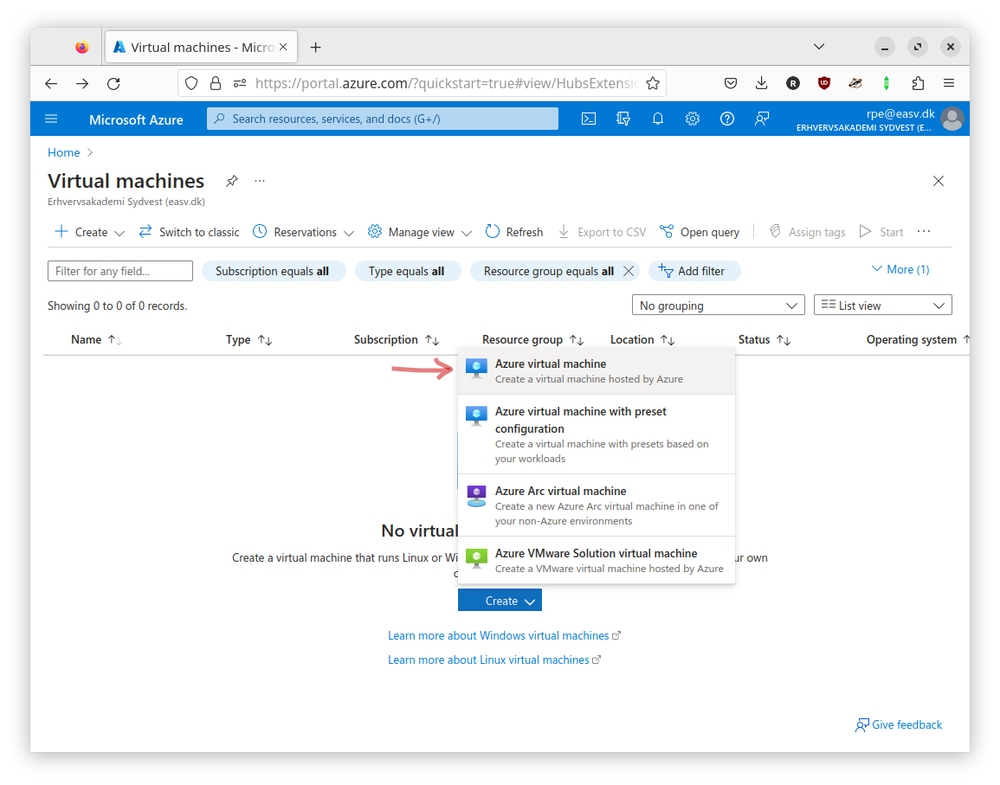
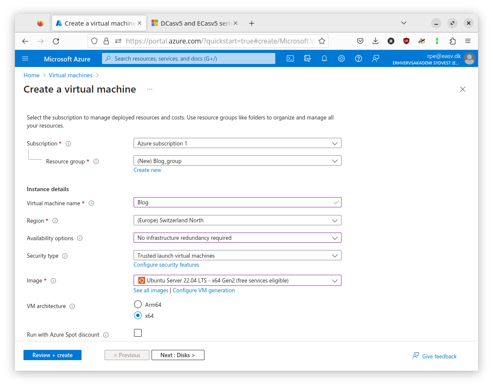
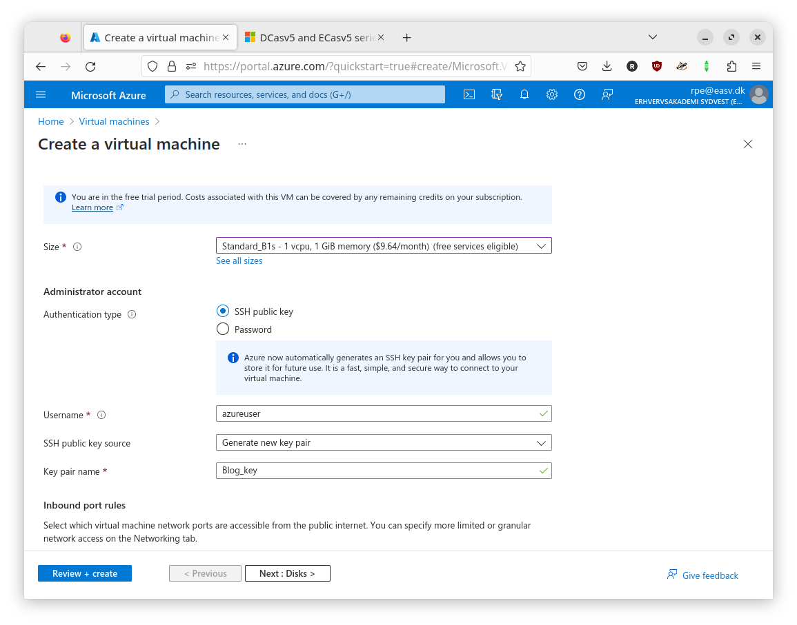
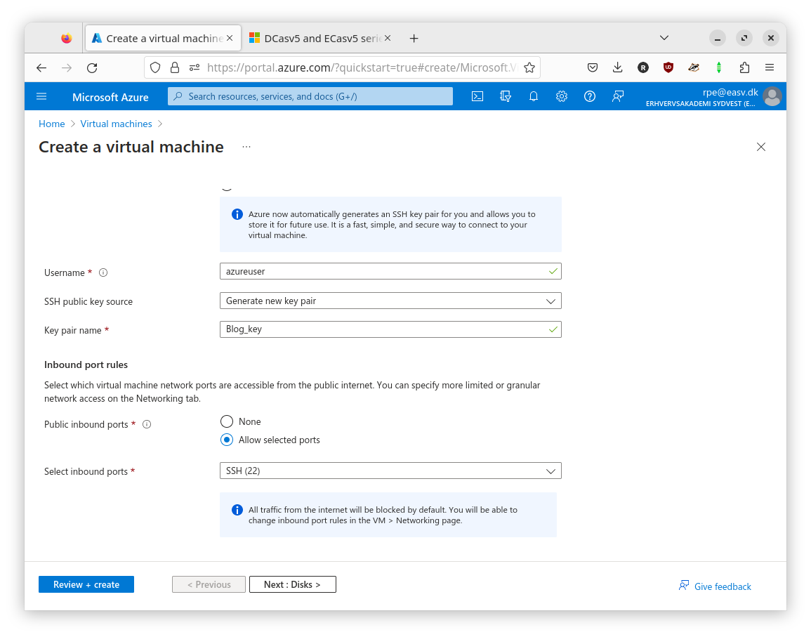
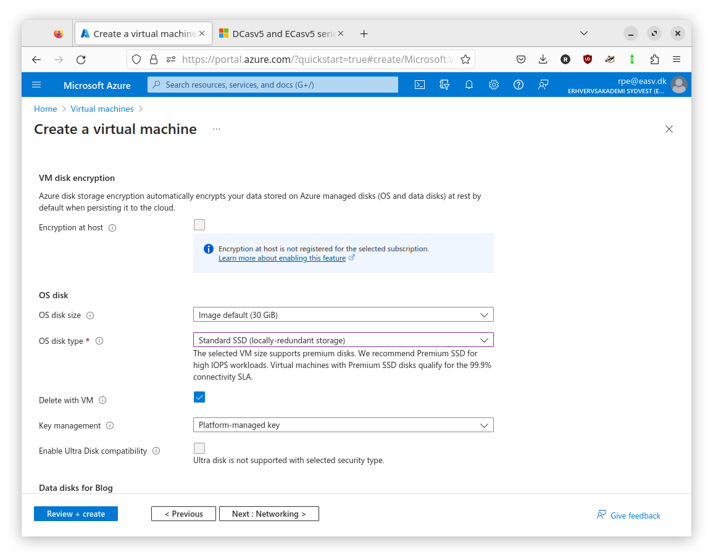
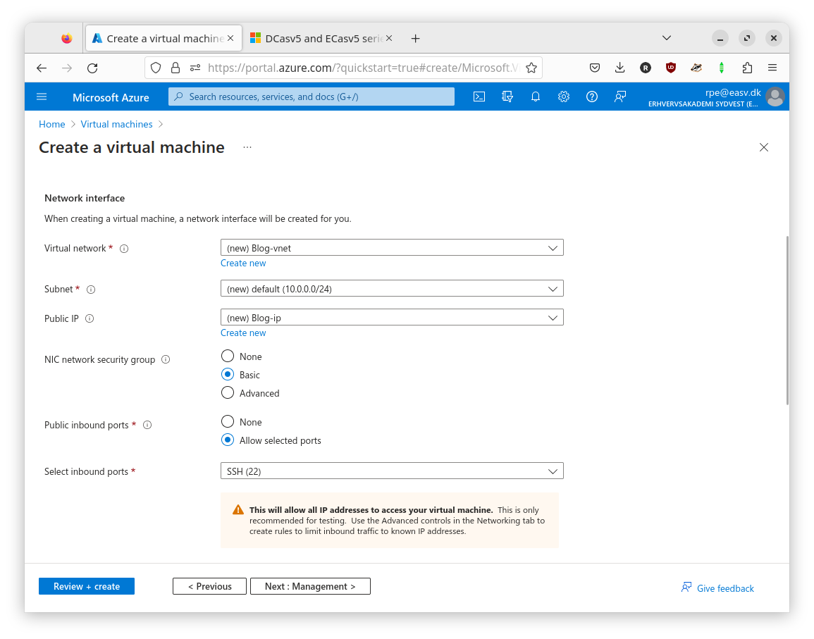
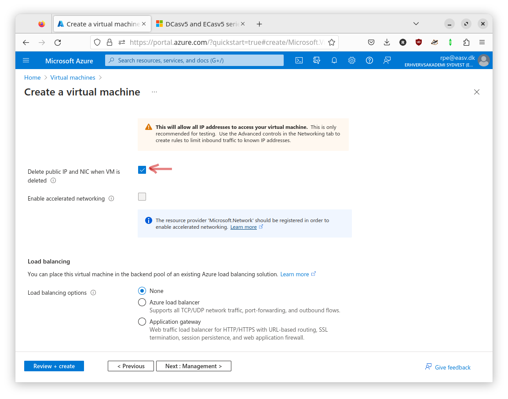
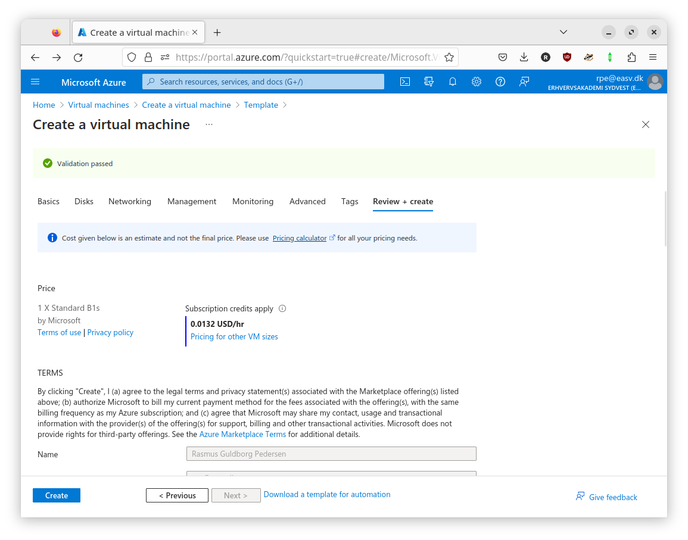

---

It is important that you download the key to a place where you can find it again.

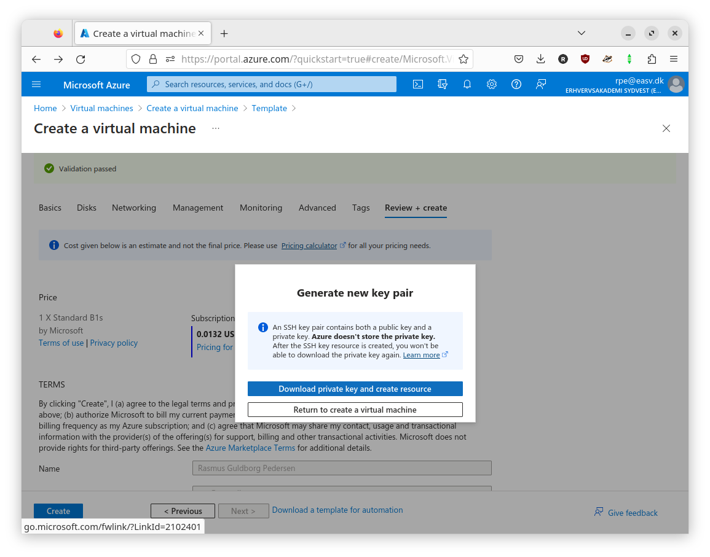

---

Lastly you need to take note of the IP for the VM you just created.

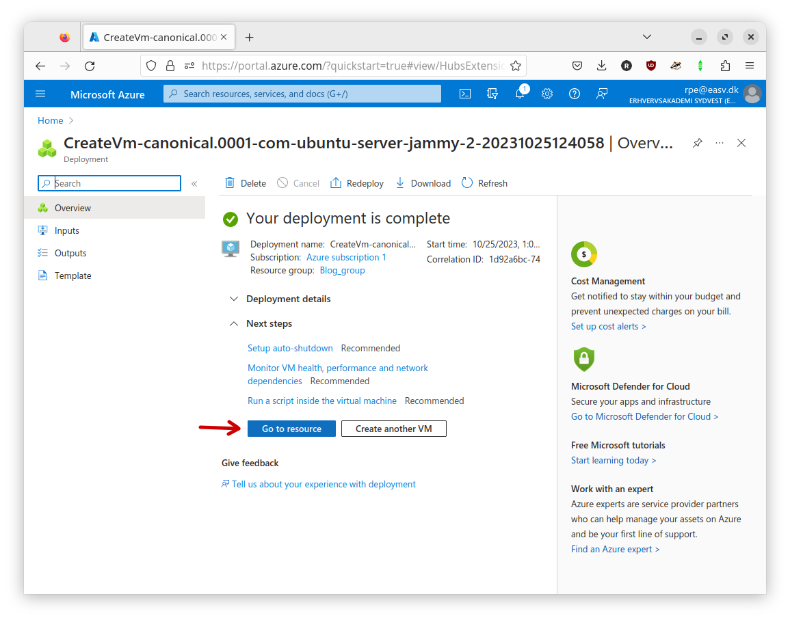
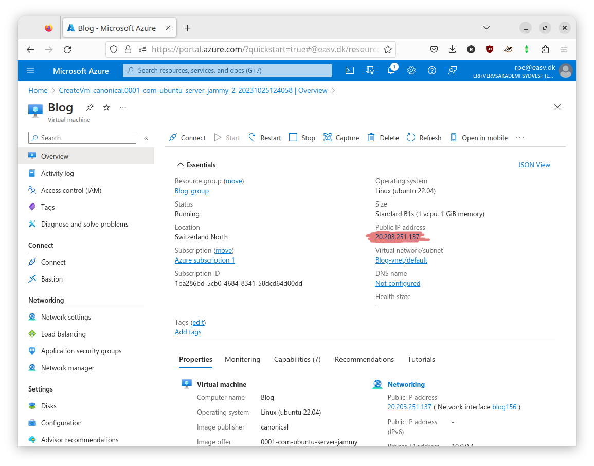