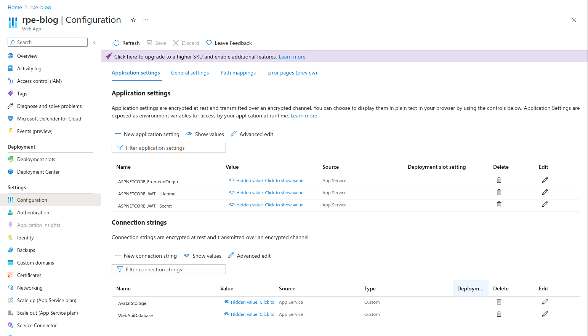

# Deployment

We need to do a bit of setup since the api and frontend will hosted on different
domains.

## Frontend changes

Add empty baseUrl to `frontend/src/environments/environment.prod.ts`

```typescript
export const environment = {
  production: false,
  baseUrl: ""
};
```

Add baseUrl to `frontend/src/environments/environment.prod.ts`

```typescript
export const environment = {
  production: true,
  baseUrl: "https://your-app-name.azurewebsites.net"
};
```

Add a new interceptor at `frontend/src/interceptors/error-http-interceptor.ts`

```typescript
import {Injectable} from "@angular/core";
import {HttpEvent, HttpHandler, HttpInterceptor, HttpRequest} from "@angular/common/http";
import {Observable} from "rxjs";
import {environment} from 'src/environments/environment';

@Injectable()
export class RewriteHttpInterceptor implements HttpInterceptor {
  intercept(req: HttpRequest<any>, next: HttpHandler):
    Observable<HttpEvent<any>> {
    if (req.url.startsWith('/')) {
      // Rewrite relative URLs to start with baseUrl from src/environments/environment
      return next.handle(req.clone({url: environment.baseUrl + req.url}));
    }
    return next.handle(req);
  }
}
```

Add it to the providers array in `frontend/src/app/app.module.ts`

```typescript
{ provide: HTTP_INTERCEPTORS, useClass: RewriteHttpInterceptor, multi: true },
```

This way the frontend can still use relative URLs in the service classes.
So we don't have to change the endpoint URL for each call.

## Backend changes

We need to set it up so we allow request from the domain/origin the frontend gets hosted on.

`api/Program.cs`

```csharp
// after app.UseSecurityHeaders();
var frontendOrigin = app.Services.GetService<IConfiguration>()!["FrontendOrigin"];
app.UseCors(policy =>
    policy
        .SetIsOriginAllowed(origin => origin == frontendOrigin)
        .AllowAnyMethod()
        .AllowAnyHeader()
);
```

## Configuration

Deploy as described in the guide from "🤖Systems Development II🤖".

Write down the URL frontend is deployed at.

On [Azure Portal](https://portal.azure.com), find your Web App resource and navigate to configuration.
Configure as seen in the picture, but use values as described in the table under.



**Application settings**

| Name | Value description |
|------|-------------------|
| ASPNETCORE_FrontendOrigin | URL for your deployed frontend |
| ASPNETCORE_JWT__Lifetime | 04:00:00 means token is valid for 4 hours |
| ASPNETCORE_JWT__Secret | Output from `openssl rand 64 | base64` |

**Connection strings**

| Name | Value description |
|------|-------------------|
| AvatarStorage | Connection string for storage container |
| WebApiDatabase | Connection string for postgres database |

This will override the default settings found in `appsettings.json`