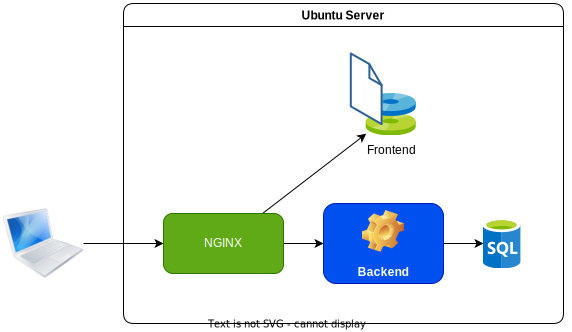
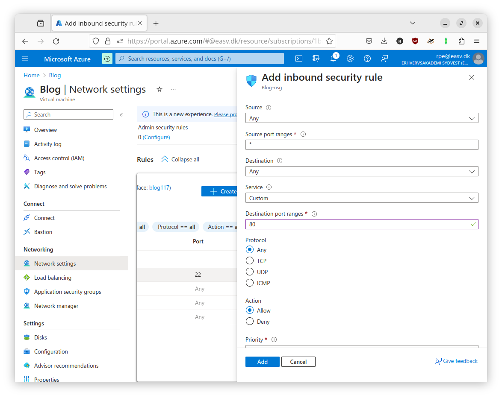
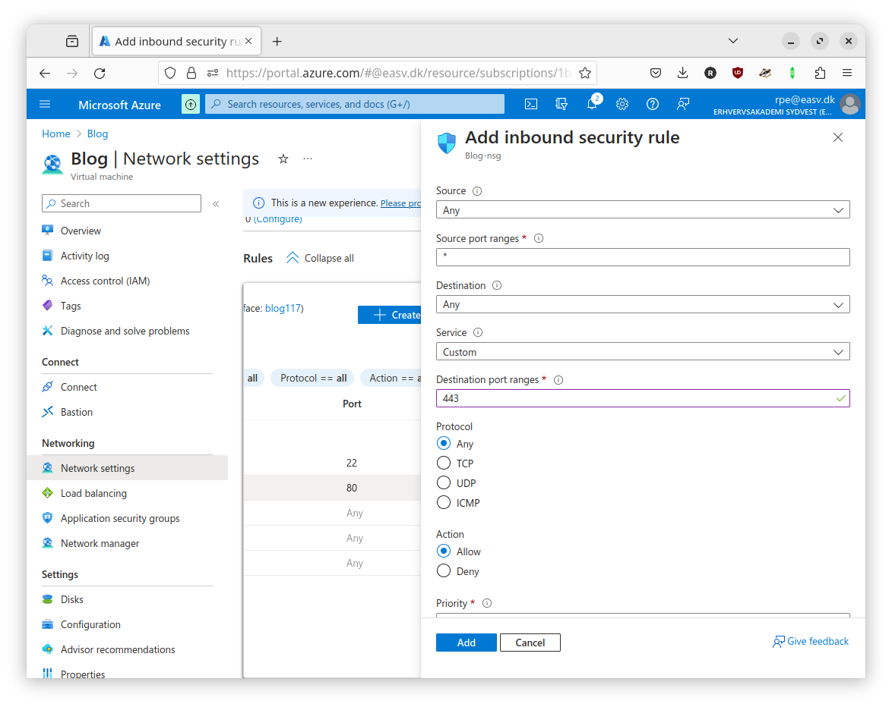

# Deploying ASP.NET to VM



## Prerequisite

You will need a SSH client installed on your computer.
There is a good change you got one already.
To check, open a CLI window (git-bash or terminal) and type `ssh` .

If you get a command not found, check [Get started with OpenSSH for Windows](https://learn.microsoft.com/en-us/windows-server/administration/openssh/openssh_install_firstuse).

## Azure VM

You will need to create a virtual machine on Azure.
The free credit you get should be plenty for all we are going to do.

If you don't have an account already, you need to create one by following
[these instruction](./azure_vm.md).

## SSH Client

Setup SSH client on your machine so you can easily connect to your VM in Azure.

Note: commands should be executed in git-bash.

```sh
# Replace Downloads with the folder you downloaded the key to
mv Downloads/Blog_key.pem ~/.ssh
# Change permissions. Otherwise ssh will complain
chmod 600 .ssh/Blog_key.pem
```

Add to `~/.ssh/config`

```sshconfig
Host blog
    HostName <VM IP>
    User azureuser
    IdentityFile ~/.ssh/Blog_key.pem
```

Test that it works:

```sh
ssh blog
```

## Install runtime

Based on:

- [Install .NET on Linux by using an install script or by extracting binaries](https://learn.microsoft.com/en-us/dotnet/core/install/linux-scripted-manual)

The installation of dotnet would normally be done with the package manager (APT).
But since version 8.0 is still in preview, then we need to use a script instead.

**On server**

```sh
# Update system
sudo apt update && sudo apt upgrade

# Download install script
wget https://dot.net/v1/dotnet-install.sh

# Make it executable
chmod +x dotnet-install.sh

# Install ASP.NET Core 8 runtime
sudo ./dotnet-install.sh --channel 8.0 --runtime aspnetcore --install-dir /opt/dotnet
# Set DOTNET_ROOT for your environment
echo "export DOTNET_ROOT=/opt/dotnet" >> ~/.bashrc
source ~/.bashrc

# Symlink the binary so the system knows where to find it
sudo ln -s /opt/dotnet/dotnet /usr/bin/dotnet
```

> A [symlink](https://wiki.debian.org/SymLink) is a file whose purpose is to
point to another file or directory (called the "target"). That is, an "alias" or
"shortcut" to a program or file.

To make sure that the runtime works you can create a simple project on your own
machine and copy it to the server.

**On local**

```sh
mkdir helloworld
cd helloworld
dotnet new console
dotnet build
scp -r  bin/Debug/net8.0/* blog:~/helloworld
```

**On server**

```sh
./helloworld/helloworld
```

It should write "Hello, World!"

## Publish application

Based on:

- [Host ASP.NET Core on Linux with Nginx](https://learn.microsoft.com/en-us/aspnet/core/host-and-deploy/linux-nginx?view=aspnetcore-8.0&tabs=linux-ubuntu)
- [Configure ASP.NET Core to work with proxy servers and load balancers](https://learn.microsoft.com/en-us/aspnet/core/host-and-deploy/proxy-load-balancer?view=aspnetcore-8.0)

Before deploying the [blog](https://github.com/rpede/aspnet_security/tree/deployment)
project, you need to do a tiny bit bit of preparation.

You need to change the path for frontend in **Program.cs**

**Note:** make sure you are on the right branch.
If you've cloned the repository type `git checkout deployment` .

```csharp
// right before `builder.Services.AddSpaStaticFiles`...
var frontEndRelativePath = builder.Environment.IsDevelopment() ? "./../frontend/www" : "../blog_frontend";

// right before `var app = builder.Build();`
builder.Services.Configure<ForwardedHeadersOptions>(options =>
{
    options.ForwardedHeaders =
        ForwardedHeaders.XForwardedFor | ForwardedHeaders.XForwardedProto;
});

// right after `var app = builder.Build();`
app.UseForwardedHeaders();
```

See documentation for [ForwardedHeaders](https://learn.microsoft.com/en-us/dotnet/api/microsoft.aspnetcore.httpoverrides.forwardedheaders?view=aspnetcore-8.0) and [UseForwardedHeaders](https://learn.microsoft.com/en-us/dotnet/api/microsoft.aspnetcore.builder.forwardedheadersextensions.useforwardedheaders?view=aspnetcore-8.0).

Make a release build of both the frontend and backend.
Then copy to the VM.

**Local in the solution folder**

```sh
# Build frontend
npm ci --prefix frontend
npm run build --prefix frontend

# Make a release build of backend
dotnet restore
dotnet publish --configuration Release

# Copy the compiled project files
scp -pr api/bin/Release/net8.0/publish blog:~/blog_api
scp -pr frontend/www blog:~/blog_frontend
scp database.sqlite blog:~/blog_api
```

Add a production configuration with a randomly generated JWT secret.
It is **important** that the secret we use on the server is NOT stored in code
repository.

**On server**

```sh
# Generate a JWT secret
openssl rand -base64 64
# Copy the output

# Write a production configuration
vim ~/blog_api/appsettings.Production.json
```

Paste the following, but replace the JWT secret with what copied before.

```json
{
  "ConnectionStrings": {
    "WebApiDatabase": "Data Source=./database.sqlite"
  },
  "Logging": {
    "LogLevel": {
      "Default": "Information",
      "Microsoft.AspNetCore": "Warning"
    }
  },
  "JWT": {
    "Secret": "REPLACE ME",
    "Lifetime": "04:00:00"
  }
}
```

Hit ESC, type `:wq` to save.

Test the configuration:

```sh
cd blog_api
dotnet api.dll
curl http://localhost:5000
```

If you see a bunch of HTML it means that everything is working so far.

## Proxy web-server

We will use [NGINX as reverse proxy](https://docs.nginx.com/nginx/admin-guide/web-server/reverse-proxy/)
in front of our application web server.

ASP.NET Core comes with a build-in web server called Kestrel, which is what you have been using so far.

> Kestrel is great for serving dynamic content from ASP.NET Core. However, the web serving capabilities aren't as feature rich as servers such as IIS, Apache, or Nginx. A reverse proxy server can offload work such as serving static content, caching requests, compressing requests, and HTTPS termination from the HTTP server. A reverse proxy server may reside on a dedicated machine or may be deployed alongside an HTTP server.

[Source](https://learn.microsoft.com/en-us/aspnet/core/host-and-deploy/linux-nginx?view=aspnetcore-7.0&tabs=linux-ubuntu#use-a-reverse-proxy-server)

See also
[When to use Kestrel with a reverse proxy](https://learn.microsoft.com/en-us/aspnet/core/fundamentals/servers/kestrel/when-to-use-a-reverse-proxy?view=aspnetcore-8.0).

Based on:

- [Configure Nginx](https://learn.microsoft.com/en-us/aspnet/core/host-and-deploy/linux-nginx?view=aspnetcore-8.0&tabs=linux-ubuntu#configure-nginx)
- [Why does this Nginx config result in “rewrite or internal redirection cycle”](https://stackoverflow.com/questions/46514838/why-does-this-nginx-config-result-in-rewrite-or-internal-redirection-cycle)

**On server**

```sh
sudo apt install nginx
```

```sh
sudo vim /etc/nginx/sites-enabled/default
```

Paste

```nginx
map $http_connection $connection_upgrade {
  "~*Upgrade" $http_connection;
  default keep-alive;
}

server {
  listen        80;
  location ~ (/api|/graphql) {
      proxy_pass         http://127.0.0.1:5000;
      proxy_http_version 1.1;
      proxy_set_header   Upgrade $http_upgrade;
      proxy_set_header   Connection $connection_upgrade;
      proxy_set_header   Host $host;
      proxy_cache_bypass $http_upgrade;
      proxy_set_header   X-Forwarded-For $proxy_add_x_forwarded_for;
      proxy_set_header   X-Forwarded-Proto $scheme;
  }
}
```

Hit ESC. Type `:wq`

```sh
# Check the config with
sudo nginx -t

# If successful, reload nginx
sudo nginx -s reload
```

Azure VMs are behind a firewall.
Before the web server can be accessed, you need to create a security rule allowing port 80.

1. Go to "Network settings" in left panel.
2. Click "Create port rule".
3. Configure as shown in the screenshot.



In the rule you can select "My IP address" to make it only accessible from your current IP address.
Or "Any" to make it accessible to the whole internet.

You should be able to load the page in your browser now.

Type in `/api/posts` after the IP to verify that it can load from database.

## Static files

NGINX is very efficient at serving static files, so we will use it to serve the
frontend files.

By default nginx on Ubuntu runs under `www-data` user.

So we first need to make the frontend files accessible to that user.

**On server**

```sh
# Change owner to www-data
sudo chown -R www-data:www-data ~/blog_frontend/
# Readonly
sudo chmod -R 550 ~/blog_frontend/

# Move to a folder owned by www-data.
# Using /var/www is just a convention for websites.
sudo mv ~/blog_frontend /var/www/
```

Configure nginx to serve everything that doesn't match /api or /graph from
/var/www/blog_frontend.

```sh
sudo vim /etc/nginx/sites-enabled/default
```

Change to:

```nginx
map $http_connection $connection_upgrade {
  "~*Upgrade" $http_connection;
  default keep-alive;
}

server {
  listen        80;

  root /var/www/blog_frontend;
  index index.html index.htm;

  location ~ (/api|/graphql) {
      proxy_pass         http://127.0.0.1:5000;
      proxy_http_version 1.1;
      proxy_set_header   Upgrade $http_upgrade;
      proxy_set_header   Connection $connection_upgrade;
      proxy_set_header   Host $host;
      proxy_cache_bypass $http_upgrade;
      proxy_set_header   X-Forwarded-For $proxy_add_x_forwarded_for;
      proxy_set_header   X-Forwarded-Proto $scheme;
  }
  location / {
      try_files $uri $uri/ /index.html =404;
  }
}
```

Reload nginx configuration.

```sh
sudo nginx -s reload
```

Verify that you can access the website.

## System(d) service

Based on:

- [Create the service file](https://learn.microsoft.com/en-us/aspnet/core/host-and-deploy/linux-nginx?view=aspnetcore-8.0&tabs=linux-ubuntu#create-the-service-file)

All looks good.
However there is still a huge problem.
If the .NET server crashes there is nothing to restart it.

It is better to manage the process as a system service that automatically starts
and restarts on a crash.

In most modern Linux distributions (including Ubuntu), the thing that is
responsible for managing services is called
[systemd](https://wiki.debian.org/systemd).

**On server**

```sh
# Shutdown the backend server
pkill dotnet

# To improve security lets change to an unprivileged user for the backend
sudo chown -R www-data:www-data ~/blog_api/
sudo chmod -R 550 ~/blog_api/
sudo mv ~/blog_api /var/www/

# Create a service definition file
sudo vim /etc/systemd/system/blog-api.service
```

Add the following service definition:

```ini
[Unit]
Description=ASP.NET Blog API running on Linux

[Service]
WorkingDirectory=/var/www/blog_api
ExecStart=/usr/bin/dotnet /var/www/blog_api/api.dll
Restart=always
# Restart service after 10 seconds if the dotnet service crashes:
RestartSec=10
KillSignal=SIGINT
SyslogIdentifier=blog-api
User=www-data
# Additional environment variables can be set here
Environment=ASPNETCORE_ENVIRONMENT=Production
Environment=DOTNET_PRINT_TELEMETRY_MESSAGE=false

[Install]
# Start when system starts
WantedBy=multi-user.target
```

ESC, `:wq`

```sh
# Enable the service so it starts up on system boot
sudo systemctl enable blog-api.service

# Start the service
sudo systemctl start blog-api.service
```

## HTTPS

Based on:
  - [How To Secure Nginx with Let's Encrypt on Ubuntu 20.04](https://www.digitalocean.com/community/tutorials/how-to-secure-nginx-with-let-s-encrypt-on-ubuntu-20-04)
  - [Add Custom Domain to Azure VM or resource](https://learn.microsoft.com/en-us/azure/virtual-machines/custom-domain)

Before HTTPS can be configured, a domain name for the VM is required.


1. Select your VM in the portal.
2. In the left menu, select Properties
3. Under Public IP address\DNS name label, select your IP address. The Configuration page will open.
4. Under DNS name label, enter the prefix you want to use.
5. Select Save at the top of the page.
6. Select Overview in the left menu to return to the VM overview blade.
7. Verify that the DNS name appears correctly.

Enter the full DNS name address bar in your browser to verify.

Because HTTPS has port 443 as default, you will need to add another port rule for it.

1. Go to "Network settings" in left panel.
2. Click "Create port rule".
3. Configure as shown in the screenshot.



**Important:** If you set the rule for port 80 to "My IP address" then you need
to change it to "Any".

**On server**

```sh
sudo vim /etc/nginx/sites-enabled/default
```

Right after

```nginx
server {
  listen        80;
```
Add following, but replace example.com with the DNS name for your VM:

```nginx
server_name example.com;
```

ESC, `wq`

```sh
# Reload nginx
sudo nginx -s reload
```

Let's Encrypt offers free TLS certificates.
Like all other [certificate authorities](https://en.wikipedia.org/wiki/Certificate_authority)
for TLS, it requires validation of the host.

Certbot automates the process.


```sh
# Install certbot
sudo apt install certbot python3-certbot-nginx

# Retrieve and configure a certificate.
# Replace with the DNS name of your VM
sudo certbot --nginx -d example.com --register-unsafely-without-email
```

You should see output like this:

```
Please choose whether or not to redirect HTTP traffic to HTTPS, removing HTTP access.
- - - - - - - - - - - - - - - - - - - - - - - - - - - - - - - - - - - - - - - -
1: No redirect - Make no further changes to the webserver configuration.
2: Redirect - Make all requests redirect to secure HTTPS access. Choose this for
new sites, or if you're confident your site works on HTTPS. You can undo this
change by editing your web server's configuration.
- - - - - - - - - - - - - - - - - - - - - - - - - - - - - - - - - - - - - - - -
Select the appropriate number [1-2] then [enter] (press 'c' to cancel):
```

Select `2` to have requests redirected.

Enter the DNS name in the address bar of your browser.
It should look something like this:


TLS certificates need to be renewed periodically.
Luckily there is service to have it renewed automatically.
Otherwise you will be in trouble after 90 days when the certificate expires.

```sh
# Verify that is is active
sudo systemctl status certbot.timer

# Test that it is working with a dry-run
sudo certbot renew --dry-run
```

## Troubleshooting

View NGINX log:

```sh
cat /var/log/nginx/error.log
```

View service log:

```sh
journalctl -u blog-api.service
```

View permissions:

```sh
sudo ls -l /path/to/folder
```